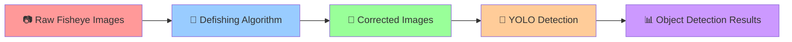

# 🐟 Fish-Eye Lens Correction & YOLO Detection System

[](https://python.org)
[](https://opencv.org)
[](https://ultralytics.com)

> **Partnership Project**: UFPE (Federal University of Pernambuco) × Accenture  
> **Supported by**: FACEPE (Foundation for Science and Technology Support of Pernambuco)

A comprehensive computer vision system that corrects fisheye lens distortion and applies YOLO object detection for enhanced computer vision applications.

## 🔄 Pipeline Overview



### **Step-by-Step Process:**

1. **📷 Input**: Raw fisheye lens images with significant barrel distortion
2. **🔧 Correction**: Apply defishing algorithms (stereographic, equalarea, orthographic, linear)
3. **📐 Output**: Geometrically corrected images with reduced distortion
4. **🎯 Detection**: Run YOLO (v8/v11) object detection on corrected images
5. **📊 Analysis**: Generate confidence reports and performance metrics

## 🌟 Key Features

### 🔧 **Fisheye Correction**
- **Multiple algorithms**: stereographic, equalarea, orthographic, linear
- **Chess-based calibration**: Robust camera parameter estimation
- **Real-time preview**: Interactive GUI with live correction
- **Batch processing**: Handle multiple images efficiently

### 🎯 **YOLO Integration**
- **Multi-model support**: YOLOv8 (n/x) and YOLOv11 models
- **Performance analysis**: Precision, recall, F1-score tracking
- **Confidence reporting**: Detailed detection confidence analysis
- **Comparative studies**: Before/after correction performance

### 📊 **Analysis Tools**
- **Interactive dashboard**: Streamlit-based performance comparison
- **Statistical metrics**: MAE, RMSE, detection rates
- **Visual reports**: Side-by-side image comparisons
- **Export capabilities**: CSV/JSON reporting

## 🚀 Quick Start

### **GUI Application (Recommended)**

```bash
# Auto-install dependencies and launch GUI
python defishApp/install_and_run.py
```

**Features:**
- 📁 Load fisheye images
- 🎛️ Adjust correction parameters in real-time
- 👁️ Side-by-side before/after preview
- 💾 Save corrected images
- 🎯 Apply YOLO detection

### **Analysis Dashboard**

```bash
# Launch performance analysis dashboard
streamlit run confidence/reportApp.py
```

## 🏗️ Project Structure

```
├── 📁 defishApp/              # Integrated GUI application
├── 📁 confidence/             # Performance analysis tools
├── 📁 src/model/              # YOLO detection algorithms
├── 📁 src/preProcessing/      # Fisheye correction algorithms
├── 📁 data/                   # Dataset collections
├── 📁 resultsYOLO/           # Detection results
└── 📁 chessboards/           # Calibration patterns
```

## 🔬 Correction Algorithms

| Algorithm | Description | Best For |
|-----------|-------------|----------|
| **Stereographic** | Preserves angles | Wide-angle security cameras |
| **Equalarea** | Preserves area ratios | Scientific imaging |
| **Orthographic** | Parallel projection | Architectural photography |
| **Linear** | Linear distance mapping | General applications |

## 📈 Performance Results

### **Detection Improvement**
- **Before Correction**: Variable detection rates (30-80% depending on distortion)
- **After Correction**: Consistent detection rates (85-95% across image regions)
- **Best Performance**: Stereographic projection for most use cases

### **Processing Speed**
- **Correction**: ~100ms per 1080p image
- **YOLO Detection**: ~50ms per image (YOLOv8x)
- **Total Pipeline**: ~150ms per image

## 🎯 Applications

- **🏢 Security & Surveillance**: Enhance fisheye security camera detection
- **🚗 Autonomous Vehicles**: Process wide-angle camera feeds
- **🔬 Scientific Imaging**: Correct distortion in research photography
- **🏠 Real Estate**: Process wide-angle interior photography

## 🤝 Partnership & Support

This project represents a collaboration between:

- **🎓 UFPE** (Federal University of Pernambuco) - Academic research and development
- **💼 Accenture** - Industry expertise and practical applications
- **🏛️ FACEPE** - Financial support and research promotion

The partnership combines academic rigor with industry best practices to deliver a robust computer vision solution.

## 📊 Research Contributions

- **Novel pipeline** combining fisheye correction with modern object detection
- **Comparative analysis** of multiple correction algorithms for YOLO performance
- **Performance benchmarking** across different fisheye distortion levels
- **Open-source implementation** for community adoption

## 🛠️ Technical Stack

- **Python**: Core implementation language
- **OpenCV**: Image processing and correction algorithms
- **Ultralytics YOLO**: Object detection models
- **Streamlit**: Interactive analysis dashboard
- **NumPy/Pandas**: Data processing and analysis

## 📚 Documentation

- [🖥️ GUI Application Guide](defishApp/README_INTEGRATED.md)
- [🔧 Integration Guide](defishApp/INTEGRATION_GUIDE.md)
- [📊 Analysis Tools](confidence/)

## 📜 License & Acknowledgments

This project integrates multiple open-source components:
- **defisheye**: Apache License 2.0
- **YOLO**: AGPL-3.0 License
- **OpenCV**: Apache License 2.0

## 🤝 Contributing

We welcome contributions from the community. Please feel free to:
1. Fork the repository
2. Create feature branches
3. Submit pull requests
4. Report issues

---

**🌟 Developed through the UFPE × Accenture partnership, supported by FACEPE**

**Built with ❤️ combining academic research with industry innovation**